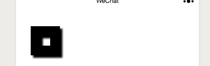
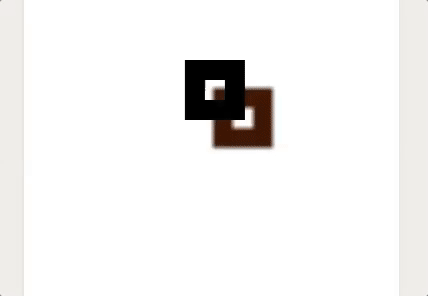
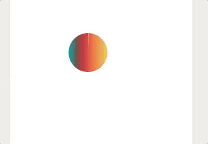
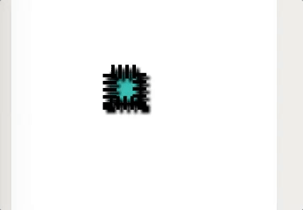
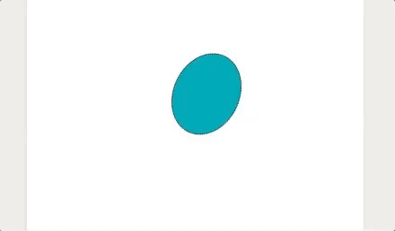
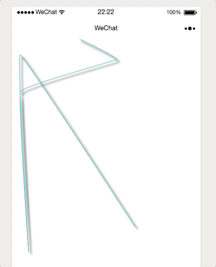
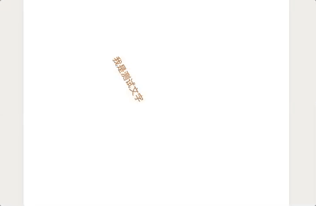

# 动画

几乎所有的是数字的属性都可以进行动画


##  公共参数
| 参数  | 类型   | 必填   | 是否支持动画   |
| :--- | :----: | ----: |:---:  |
| lineWidth		| Number |  否   |<span style="color:red;">是</span>|
| shadow    |Object |  否   |<span style="color:red;">是</span>|
| fillStyle    | Number |  否   |<span style="color:red;">是</span>|
|strokeStyle	|Number|否|<span style="color:red;">是</span>
|rotate	|Number|否|<span style="color:red;">是</span>
|lineDash	|Array|否|<span style="color:red;">是</span>
|lineCap|String|否|否
| lineJoin|String|否|否 
| miterLimit|Number|否|<span style="color:red;">是</span>
|  gra|Array|否| 否
|  isLineDash|Bealoon|否| 否
|  needShadow|Bealoon|否| 否
|  needGra|String|否| 否


示例

创建了矩形线框 如图

```js
 var rect = new Shape('rect', { x: 60, y: 60, w: 40, h: 40, lineWidth: 20, fillStyle: "#2FB8AC", 
                                rotate: Math.PI / 2, needShadow: true}, 'stroke', true);
```




然后执行

```js
rect.animate("shadow", { color:"#F56218",offsetX:100,offsetY:100}, { duration: 1000 })
              .animate({ "lineWidth": "-=10", "y": "-=30", "rotate": "10", "fillStyle": "#1BB0CE" },
               { duration: 1000 }).start(3);
```



?> 从这里就可以看出 Shape对象的animate方法支持链式调用

### animate 方法

#### 单属性变化动画
| 参数  | 类型   | 必填   | 说明   |
| :--- | :----: | ----: |:---:  |
| whitch		| String | 是|哪个属性变化 |
| exe		|String 或者Number |  是   |怎么变化 支持直接设定目标值,也支持 "+=100" "-=100" 这种相对的形式|
|option    |Object |  否   |后面详解|

```js
rect.animate("x", "+=100", { duration: 1000 })
            .start(3);
```

#### 多属性变化动画

| 参数  | 类型   | 必填   | 说明   |
| :--- | :----: | ----: |:---:  |
| whitch		|Object | 否|哪些属性变化 | 
|option    |Object |  否   |后面详解|

```js
rect.animate({ "lineWidth": "-=10", "y": "-=30", "rotate": "10", "fillStyle": "#1BB0CE" },
               { duration: 1000 }).start(3);
```

!> 特别注意 `shadow` `lineDash` `fillStyle` `strokeStyle` 这类特殊值只能设置目标值而不能像`x`,`y`一样设置"+=100"这种相对目标，即使shadow里面有offsetX这类接收纯数字的值


##### option参数详解

| 参数  | 类型   | 必填   | 说明   |
| :--- | :----: | ----: |:---:  |
|duration		| Number | 否|动画持续时间单位ms 默认 1000ms|
| onStart| Function | 否   |动画开始的时候得回调函数|
| onLooping    |Function |  否   |动画循环的时候得回调函数|
| onEnd    |Function |  否   |动画结束的时候得回调函数|
|easing|String|否|缓动动画类型 默认'linear'[看这里easing的图示](http://easings.net/zh-cn)
 
 
###### 支持的easing
  - linear
  - easeOutQuad
  - easeInOutQuad
  - easeInCubic
  - easeOutCubic
  - easeInOutCubic
  - easeInQuart
  - easeOutQuart
  - easeInOutQuart
  - easeInQuint
  - easeOutQuint
  - easeInOutQuint
  - easeInSine
  - easeOutSine
  - easeInOutSine
  - easeInExpo
  - easeOutExpo
  - easeInOutExpo
  - easeInCirc
  - easeOutCirc
  - easeInOutCirc
  - easeOutBounce
  - easeInBack
  - easeOutBack
  - easeInOutBack
  - elastic
  - swingFromTo
  - swingFrom
  - swingTo
  - bounce
  - bouncePast
  - easeFromTo
  - easeFrom
  - easeTo

### start方法

start是与animate一起使用的，animate执行之后，使用start变会立即开始动画。

- `start()` 一个参数不加 便是执行一次 
- `start(true)` 加true 便是一直重复这段动画
- `start(n)` 加大于0的整数n 便是重复这段动画n次

---

## circle
option参数

| 参数  | 类型   | 必填   | 支持动画否   |
| :--- | :----: | ----: |:---:  |
| x		| Number |  是   |<span style="color:red;">是</span>|
| y    | Number |  是   |<span style="color:red;">是</span>|
| r    | Number |  是   |<span style="color:red;">是</span>|
|sA	|Number|否|<span style="color:red;">是</span>
|eA	|Number|否|<span style="color:red;">是</span>

示例

```js
let circle = new Shape('circle', { x: 160, y: 160, r: 40, sA: 0 fillStyle: "#C0D860",
                         strokeStyle: "#CC333F", rotate: 20, lineWidth: 0, 
 					       needGra: 'line', gra: [[0, '#00A0B0'], [0.2, '#6A4A3C'], [0.4, '#CC333F'], 
 					       [0.6, '#EB6841'], [1, '#EDC951']]}, 'fill', true);
 					       
 					       
```

执行

```js
circle.animate("sA", Math.PI*3/2, { duration: 1500, easing:"bouncePast" }).start(1);
```




## rect

option参数

| 参数  | 类型   | 必填   | 事都支持动画   |
| :--- | :----: | ----: |:---:  |
| x		| Number |  是   |<span style="color:red;">是</span>|
| y    | Number |  是   |<span style="color:red;">是</span>|
| w    | Number |  是   |<span style="color:red;">是</span>|
|h|Number|否|<span style="color:red;">是</span>


创建矩形

```js
    var rect = new Shape('rect', { x: 160, y: 160, w: 40, h: 40, lineWidth: 20, 
    						 fillStyle: "#2FB8AC", rotate: Math.PI / 2, 
    						  needShadow: true, isLineDash: true, 
    						  lineDash: [[5, 5], 5], lineJoin:"miter",miterLimit:100 }, 'mix', true);
```


动画

```js
rect.animate({ lineWidth: 10, w: "+=100", h: "+=50" }, { duration: 1000 })
	.animate({ x: "+=100", "rotate": "+10"}, { duration: 1000 })
	.animate({ lineDash: [[8, 6], 5] }, { duration: 1000 }).start(2)

```



## ellipse


| 参数  | 类型   | 必填   | 是否支持动画   |
| :--- | :----: | ----: |:---:  |
| x		| Number |  是   |<span style="color:red;">是</span>|
| y    | Number |  是   |<span style="color:red;">是</span>|
| a    | Number |  是   |<span style="color:red;">是</span>|
| b    | Number |  是   |<span style="color:red;">是</span>|


图形

```js
let ellipse = new Shape('ellipse', { x: 200, y: 200, a: 40, b: 100, 
			              fillStyle: "#00A0B0", rotate: Math.PI / 7, shadow:{blur:2}}, 'mix', true)
```

动画


```js
    ellipse.animate({ a: "+=100", b: "-=20" }).animate({a: "-=100", b:"+=20"}).start(3)
```




## polygon
正多边形
option参数

| 参数  | 类型   | 必填   |是否支持动画   |
| :--- | :----: | ----: |:---:  |
| x		| Number |  是   |<span style="color:red;">是</span>|
| y    | Number |  是   |<span style="color:red;">是</span>|
| r    | Number |  是   |<span style="color:red;">是</span>|
| sides    | Number |  是   |否|


示例

```js
let polygon = new Shape('polygon', { x: 200, y: 200, r: 40, sides: 9, //9边形
						  fillStyle: "#FC354C", rotate: Math.PI / 4 }, 'mix', true)
```

执行

```js
    polygon.animate({ r: "+=100", rotate: "-=20" })
    		.animate({r: "-=100", lineWidth:"+=20"}).start(3)// 这里没有加duration 还有easing是因为它们都有默认的参数 一个是1000ms 一个是'linear'
    	
```


## line

自定义线段

| 参数  | 类型   | 必填   |是都支持动画   |
| :--- | :----: | ----: |:---:  |
| points		|Array |  是   |否|
|smooth		|Bealoon |  是   |否|


?> 虽然线段没有设置x,y这个属性，但实际上一旦点位给出，那么所有顶点的质心就已经确定，而线段的移动旋转都是以质心为动画对象来实现的。

创建

```js

let line = new Shape('line', { points:[[240,373],[11,32],[28,423],[12,105],[203,41],[128,0.06]], 
               strokeStyle: "#2FB8AC",lineWidth:1, rotate: 0, needShadow: true,smooth:false },  
               'fill', true)
```

动画

```js

    line.animate({ x: "+=100", y: "-=20" }).
         animate({rotate: "-=1"}).start(3)
```




## cshape

与line类似也是如此

```js
let cshape = new Shape('cshape', {
      rotate: Math.PI / 2,
      points: [[70, 85], [40, 20], [24, 46], [2, 4], [14, 6], [4, 46]],
      lineWidth: 5,
      fillStyle: "#00A0B0",
      rotate: Math.PI / 7,
      needGra: 'circle',
      smooth:false,
      gra: [[0, '#00A0B0'], [0.2, '#6A4A3C'], [0.4, '#CC333F'], [0.6, '#EB6841'], [1, '#EDC951']]
    }, 'fill', true)
    
    
    this.wxCanvas.add(cshape);
    
    
    
    cshape.animate({ x: "+=100", y: "+=120" }).animate({
      rotate: "-=10"}).start(3)
    
```


## text

| 参数  | 类型   | 必填   | 是否支持动画  |
| :--- | :----: | ----: |:---:  |
| x		| Number |  是   |<span style="color:red;">是</span>|
| y    | Number |  是   |<span style="color:red;">是</span>|
| text    | String |  是   |否|
| fontSize|Number|否|<span style="color:red;">是</span>|
... 其余属性都是不支持动画的「除了公共属性里面 支持动画的 比如颜色 旋转 以及阴影」


```js

let text = new Shape('text', { x: 100, y: 100, text: "我是测试文字", fillStyle: "#E6781E", rotate: Math.PI / 3, needGra: 'no', gra: [[0, '#00A0B0'], [0.2, '#6A4A3C'], [0.4, '#CC333F'], [0.6, '#EB6841'], [1, '#EDC951']]}, 'fill', true)

this.wxCanvas.add(text)

text.animate({ x: "+=40", y: "+=20", fillStyle: "#2B4E72" },{duration:2000}).animate({
      rotate: "-=10",
      fontSize:"+=30"
    }, { duration: 2000 }).start(1)
```


