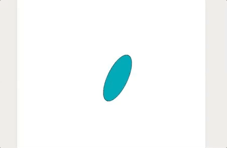
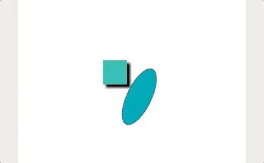

## 事件绑定

事件的绑定

!> 要想绑定事件 首先必须按照项目基本设置里面一样将一些感应事件的函数绑定到canvas标签上[看这里](config?id=%e6%b7%bb%e5%8a%a0%e5%bf%85%e8%a6%81%e7%9a%84js)

然后就特别简单了

支持的事件有
- drag 「这不是原生事件」
- touchstart
- touchmove
- touchend
- tap
- longpress
- tap

[详细解释看这里](https://mp.weixin.qq.com/debug/wxadoc/dev/framework/view/wxml/event.html)


譬如我已经创建好了一个ellipse，我要他点击后a轴变成100,填充色变为灰色

```js
 ellipse.bind('tap',function(){
      ellipse.updateOption({a:100,fillStyle:"#cccddd"})
    });
```



?> 同理其他

示例
longpress

```js
ellipse.bind('longpress',function(){

      rect.destroy();
    });
```



## 解除事件绑定


这个就更简单了
只要你不是bind的匿名函数

```js
let fuc = function(){

      rect.destroy();
    });


ellipse.bind('longpress',fuc);

```

解除时只需要

```js
ellipse.unbind('longpress',fuc);
```
那么此事件就不会触发这个函数了 是不是特别像DOM操作 O(∩_∩)O哈哈~


## 事件特别说明

1. 由于小程序的canvas并不带isPointInPath这一类比较底层的与计算机图形学相关的API，所以wxDraw所有关于图形的事件判断，都是通过将点位进过矩阵变化再经过数学的特别算法计算的，在多边形上面基本没有问题，**但是在纯边的line上或者是lineWidth特别宽的情况下的扇形以及lineWidth特别宽情况下的cshape**，它们的事件在有一些地方会感应不到，这一点，现在我还没想到更好的解决方法，还请避免lineWidth特别大的情况。

2. 在一个物体进行动画时，为了避免冲突，所以即使他设置了可以drag，但是在他进行动画时是drag不动的。
