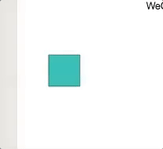
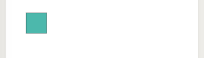
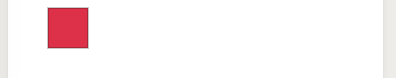
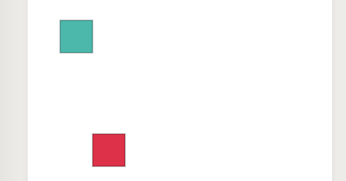
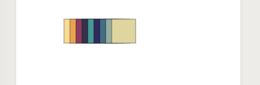
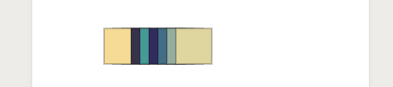
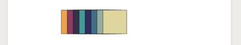

# Shape对象
> 用于创建形状的时候使用

### 属性

| 参数  | 类型   | 必填   | 说明   |
| :--- | :----: | ----: |:---:  |
| type		| String |  是   |创建形状类型 <br>目前支持rect「矩形」，circle「圆形 包括扇形」，ellipse「椭圆」，polygon「正多边形」，cshape『这是一个生造词』「用户自定义的图形」，line「线段」|
| option		|Object |  是   |所有关于形状的属性 详细说明在后面每一个形状里面|
| way    |string |  否   |图形的绘制方式 填充 'fill',描边 'stroke',混合绘制 'mix'，默认fill|
| draggable    | Bealoon |  否   |是否可以拖拽，true 是可以，false是不可以，默认 false|

### 方法

#### animate 
?>  动画方法 将在animate里面详述

---

#### start
?> 同上

---

#### setOrigin

!> 特别注意 设置了 draggable 为 true 之后 没法设置 rotateOrigin 为自身中心以外的点！！

设置形状的旋转中心

| 参数  | 类型   | 必填   | 说明   |
| :--- | :----: | ----: |:---:  |
| origin		|Array |  是   |旋转中心设置 用于设置形状旋转的时候 围绕的点|


?> 在没有设置旋转中心时，形状是围绕自身质心旋转的

```js
rect.animate("rotate", Math.PI * 5, { duration: 5000 }).start(1);
```


```js
rect.setOrigin([100,100]);//设置旋转中心为 （100 ，100）
rect.animate("rotate", Math.PI * 5, { duration: 5000 }).start(3);
```


---

#### updateOption
更新形状的属性 几乎所有属性，具体属性将在每一个形状上单独讲解


| 参数  | 类型   | 必填   | 说明   |
| :--- | :----: | ----: |:---:  |
|option		|Object |  是   |属性|


##### 示例
创建了一个rect添加到画布上
```js
 var rect = new Shape('rect', { x: 60, y: 60, w: 40, h: 40, fillStyle: "#2FB8AC", rotate: Math.PI / 2 }, 'mix', true);
 this.wxCanvas.add(rect);
```


再在后面加上
```js
    rect.updateOption({ fillStyle:"#E6324B"});

```




#### clone
从当前图形对象 clone出一个新的对象 

现在在上面代码上作如下改变

```js 
    let rect = ...//如上
    this.wxCanvas.add(rect);
    
    
    let rect2 = rect.clone();

    this.wxCanvas.add(rect2);

    rect.updateOption({ fillStyle:"#E6324B",x:100,y:200});
```




#### bind
绑定事件

?> 事件类方法将在 事件里面说明

#### unbind

取消绑定

?> 同上

#### updateLayer
就像CSS一样,wxDraw里面每一个图形 都有自己的图层，这会影响到他们之间的互相覆盖，以及当同时点击到了两个及其以上图形时只有最上层的图形才会响应事件。
各个图形最初的层级 与他们添加到wxDraw里面的先后顺序有关，简单地说就是「后来居上」，但是这个层级并不是就这样固定了，可以通过这个updateLayer来更改自己的层级。

| 参数  | 类型   | 必填   | 说明   |
| :--- | :----: | ----: |:---:  |
|layer		|String 或者 Number |  是   |「层级」可以直接 设置具体的层级数字，但是如果大于最大层级或者小于零 那么当前物体层级只会按照 最大层级或者最小层级来设置<br/> 也可以设置相对增减 来移动层级比如 "+2" 那就是向上升2层，同理"-2"就是向下减两层，同样的 如果所设置的层级大于最大层级或者小于零 那么当前物体层级只会按照 最大层级或者最小层级来设置|

示例

```js

    let rect2 = rect.clone();
    let rect3 = rect.clone();
    let rect4 = rect.clone();
    let rect5 = rect.clone();
    let rect6 = rect.clone();
    let rect7 = rect.clone();
    let rect8 = rect.clone();
    let rect9 = rect.clone();
    let rect10 = rect.clone();
    let rect11 = rect.clone();

    this.wxCanvas.add(rect2);
    this.wxCanvas.add(rect3);
    this.wxCanvas.add(rect4);
    this.wxCanvas.add(rect5);
    this.wxCanvas.add(rect6);
    this.wxCanvas.add(rect7);
    this.wxCanvas.add(rect8);
    this.wxCanvas.add(rect9);
    this.wxCanvas.add(rect10);

    rect2.updateOption({ fillStyle:"#F8DB9A",x:100,y:200});
    rect3.updateOption({ fillStyle:"#F3A358",x:110,y:200});
    rect4.updateOption({ fillStyle:"#933C60",x:120,y:200});
    rect5.updateOption({ fillStyle:"#37324A",x:130,y:200});
    rect6.updateOption({ fillStyle:"#329996",x:140,y:200});
    rect7.updateOption({ fillStyle:"#302C5B",x:150,y:200});
    rect8.updateOption({ fillStyle:"#3C6C84",x:160,y:200});
    rect9.updateOption({ fillStyle:"#92AD9F",x:170,y:200});
    rect10.updateOption({ fillStyle:"#E1D5A3",x:180,y:200});
    
```



再执行
```js
rect2.updateLayer("+2");
```




#### destroy
销毁 图形，将图形在wxDraw画布上 消除
没有参数，执行只要已经被添加到wxDraw画布里面就会被清除掉，不会影响其他的图形。

接着以上的代码

如果我执行

```js
rect2.destroy();
```
### updateText

参数 text
 !> 仅用于 text更新text用的 这里没设计好 后期会调整

