##  公共参数
| 参数  | 类型   | 必填   | 说明   |
| :--- | :----: | ----: |:---:  |
| lineWidth		| Number |  否   |线宽 默认0.5|
| shadow    |Object |  否   |阴影  内部参数在后面说明|
| fillStyle    | Number |  否   |填充颜色  现在只支持 16进制颜色|
|strokeStyle	|Number|否|边框颜色 只支持16进制颜色
|rotate	|Number|否|旋转角度
|lineDash	|Array|否|设置虚线属性 具体参数后面说明
|lineCap|String|否|设置线条的端点样式。范围 'butt'、'round'、'square'
| lineJoin|String|否|设置线条的交点样式。 范围 'bevel'、'round'、'miter' 
| miterLimit|Number|否|最大斜接长度 仅在 设置lineJoin为miter时生效
|  gra|Array|否| 渐变的 colorStop
|  isLineDash|Bealoon|否| 边框是否是 虚线
|  needShadow|Bealoon|否| 是否需要阴影 true时shadow项才会生效
|  needGra|String|否| 是否需要渐变 哪种渐变？<br> 'no'不渐变   'line' 线性'circle' 径向 <br> true时上面的gra项才会生效


!>  此处不再赘述说明 lineCap,lineJoin,miterLimit 如有不明白请看 「只是理解大概意思即可 小程序环境与浏览器环境有所不同 有些地方还是有些出入」

  - [canvas lineCap](https://developer.mozilla.org/en-US/docs/Web/API/CanvasRenderingContext2D/lineCap)
  - [canvas lineJoin](https://developer.mozilla.org/en-US/docs/Web/API/CanvasRenderingContext2D/lineJoin)
  - [miterLimit](https://developer.mozilla.org/en-US/docs/Web/API/CanvasRenderingContext2D/miterLimit)


### shadow参数说明
shadow内部有


| 参数  | 类型  | 说明   |
| :--- | :----: |:---: |
|offsetX	|Number|		阴影相对于形状在水平方向的偏移|
|offsetY	|Number|		阴影相对于形状在竖直方向的偏移|
|blur	|Number|	0~100	阴影的模糊级别，数值越大越模糊|
|color	|Color	|	阴影的颜色|

假设已经创建了一个rect

```js
 rect.updateOption({needShadow:true,shadow:{offsetX:5,offsetY:5,blur:5,color:"#000000"});
```

得到

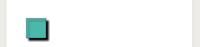


### gra参数说明 

在needGra设为line或者circle时候，gra便会起作用，
gra里面的参数为一个带有一个小于1的数值外加一个颜色值的数组的集合组成。
如

`gra:[[0, '#00A0B0'], [0.2, '#6A4A3C'], [0.4, '#CC333F'], [0.6, '#EB6841'], [1, '#EDC951']]`


!> 小于最小 stop 的部分会按最小 stop 的 color 来渲染，大于最大 stop 的部分会按最大 stop 的 color 来渲染。

!> 颜色组数至少为两组。

正如上图设置

needGra 为line时

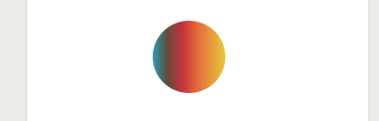


为 circle时候

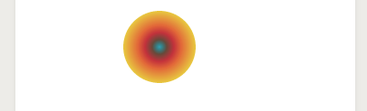


w(ーー゛)我去 这颜色怎么这么恶心

### lineDash 参数说明
这是设置虚线的细节用的
是一个Array数组。一组描述交替绘制线段和间距（坐标空间单位）长度的数字。 如果数组元素的数量是奇数， 数组的元素会被复制并重复。例如， [5, 15, 25] 会变成 [5, 15, 25, 5, 15, 25]。[详细](https://developer.mozilla.org/en-US/docs/Web/API/CanvasRenderingContext2D/setLineDash)

```js
 var rect = new Shape('rect', { x: 60, y: 60, w: 40, h: 40, 
 						lineWidth: 20, fillStyle: "#2FB8AC", rotate: Math.PI / 2, 
 						needShadow: true, isLineDash: true, lineDash:[[5, 5], 5] }, 'stroke', true);

```


---
# 图形元素
!> 以下代码只写了创建图形部分 创建wxDraw对象以及添加到画布上部分代码全部略去

## Circle

option参数

| 参数  | 类型   | 必填   | 说明   |
| :--- | :----: | ----: |:---:  |
| x		| Number |  是   |圆形中心 x坐标|
| y    | Number |  是   |圆中心 y坐标|
| r    | Number |  是   |圆半径|
|sA	|Number|否|起始弧度，单位弧度（12点钟方向开始）
|eA	|Number|否|终止弧度
|closePath	|Bealoon|否|是否闭合路径，用于 stroke 的时候 是否绘制闭合线 **新功能**

?> 公共参数已经在最上方 说明

创建一个Cirle

```js

 let circle = new Shape('circle', { x: 100, y: 100, r: 40, sA: Math.PI/4, 
 							fillStyle: "#C0D860",
 				           strokeStyle: "#CC333F", rotate: 20, lineWidth: 0, needGra: 'line', 
   				           gra: [[0, '#00A0B0'], [0.2, '#6A4A3C'], [0.4, '#CC333F'], [0.6, '#EB6841'], [1, '#EDC951']]}, 
 				          'fill', true)
 
```
得到「注意这个地方 rotate是20 所以给人感觉其实角度不是 12点钟方向」

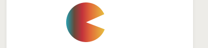


## Rect

option参数

| 参数  | 类型   | 必填   | 说明   |
| :--- | :----: | ----: |:---:  |
| x		| Number |  是   |矩形中心 x坐标|
| y    | Number |  是   |矩形中心 y坐标|
| w    | Number |  是   |矩形宽|
|h|Number|否|矩形高

?> 公共参数已经在最上方 说明

> 到处都是rect的示例 这里就不再演示

## Ellipse

option参数

| 参数  | 类型   | 必填   | 说明   |
| :--- | :----: | ----: |:---:  |
| x		| Number |  是   |椭圆中心 x坐标|
| y    | Number |  是   |椭圆中心 y坐标|
| a    | Number |  是   |椭圆x方向轴 长轴短轴 得看a b谁大谁小|
| b    | Number |  是   |椭圆y方向轴|

?> 公共参数已经在最上方 说明

```js
  let ellipse = new Shape('ellipse', { x: 200, y: 200, a: 40, b: 100, 
           				  fillStyle: "#00A0B0", rotate: Math.PI / 7 }, 'mix', true)
```

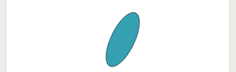

## polygon
正多边形
option参数

| 参数  | 类型   | 必填   | 说明   |
| :--- | :----: | ----: |:---:  |
| x		| Number |  是   |正多边形中心 x坐标|
| y    | Number |  是   |正多边形中心 y坐标|
| r    | Number |  是   |正多边形 中心到各顶点距离|
| sides    | Number |  是   |是多少边形状 最少为3|

?> 公共参数已经在最上方 说明


示例

```js
let polygon = new Shape('polygon', { x: 200, y: 200, r: 40, sides: 9, //9边形
						  fillStyle: "#FC354C", rotate: Math.PI / 4 }, 'mix', true)
```

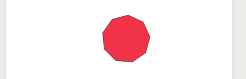


## image
图形对象
option参数

| 参数  | 类型   | 必填   | 说明   |
| :--- | :----: | ----: |:---:  |
| x		| Number |  是   |图形中心 x坐标|
| y    | Number |  是   |图形中心 y坐标|
| w    | Number |  是   |图形宽|
| h    | Number |  是   |图形高|
| file    | string |  是   |图形相对地址 「支持图片 png jpg」|


示例
```js
let img = new Shape('image', { x: 100, y: 300,w:100,h:100, file:"./1.png"}, 'fill', true)
  
```
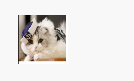


## cshape
自定义形状
option参数

| 参数  | 类型   | 必填   | 说明   |
| :--- | :----: | ----: |:---:  |
| points		|Array |  是   |自定义形状的所有顶点|
|smooth		|Bealoon |  是   |是否光滑|
?> 公共参数已经在最上方 说明

示例

``` js
  let cshape = new Shape('cshape', {
      rotate: Math.PI / 2,
      points: [[70, 85], [40, 20], [24, 46], [2, 4], [14, 6], [4, 46]],
      lineWidth: 5,
      fillStyle: "#00A0B0",
      rotate: Math.PI / 7,
      needGra: 'circle',
      smooth:false,
      gra: [[0, '#00A0B0'], [0.2, '#6A4A3C'], [0.4, '#CC333F'], [0.6, '#EB6841'], [1, '#EDC951']]
    }, 'fill', true)

```

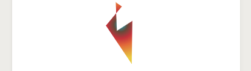


## line

自定义线段

| 参数  | 类型   | 必填   | 说明   |
| :--- | :----: | ----: |:---:  |
| points		|Array |  是   |自定义线段的所有顶点|
|smooth		|Bealoon |  是   |是否光滑 也就是是否是光滑的线段 默认true|

示例

不光滑

```js

let line = new Shape('line', { points:[[240,373],[11,32],[28,423],[12,105],[203,41],[128,0.06]], 
               strokeStyle: "#2FB8AC",lineWidth:1, rotate: 0, needShadow: true,smooth:false },  
               'fill', true)

```
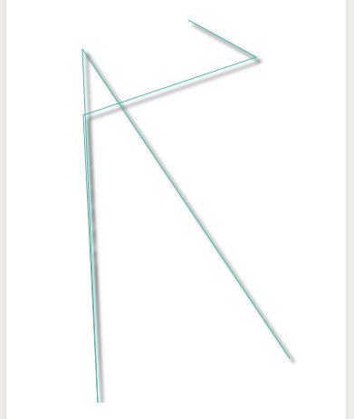

光滑

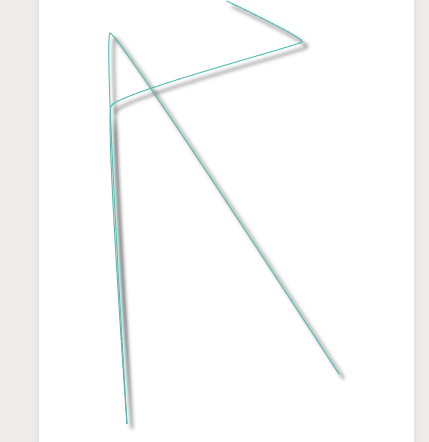

?> line的填充方式 无论是 fill还是stroke 还是mix 都是一样的
!> 由于小程序一些重要的api缺失「比如 isPointInPath」在点击的判断上 我


## text

文字


| 参数  | 类型   | 必填   | 说明   |
| :--- | :----: | ----: |:---:  |
| x		| Number |  是   |字体x坐标|
| y    | Number |  是   |字体y坐标|
| text    | String |  是   |文字正文|
| fontSize|Number|否|字号|
| align    | String |  否   |左右对齐方式 	可选值 'left'、'center'、'right' 「别告诉我你不懂」|
|textBaseline|String|否 | 上下对齐方式 可选值 'top'、'bottom'、'middle'、'normal' |

---

##### align

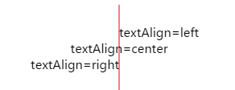

---

##### textBaseline
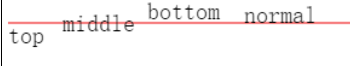

---

示例

```js
  let text = new Shape('text', { x: 200, y: 200, text: "我是测试文字", 
                      fillStyle: "#E6781E", rotate: Math.PI / 3}
                      'fill', true)
```

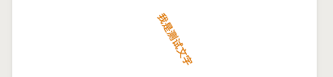


