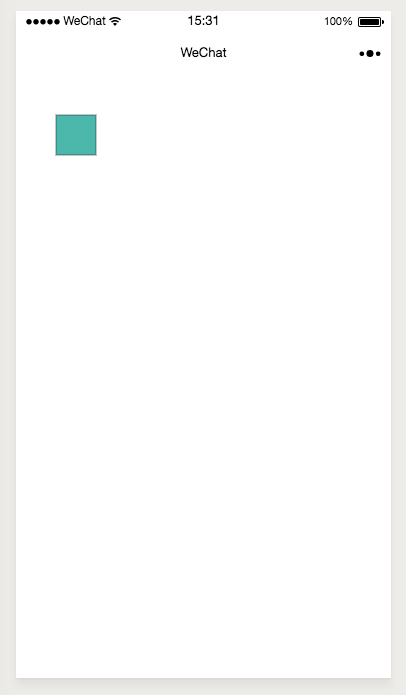
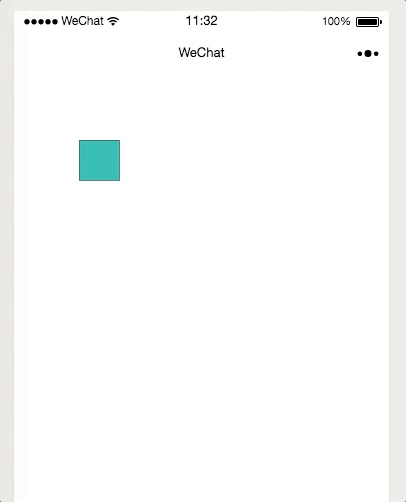

  按照上述配置之后，我们得到了如下的index.js
  ```js
  //index.js
  const app = getApp()
  var wxDraw = require("../../utils/wxdraw.min.js").wxDraw;
  var Shape = require("../../utils/wxdraw.min.js").Shape;


  Page({
    data: {
      userInfo: {},
      hasUserInfo: false,
      wxCanvas:null// 注意这里 需要创建一个对象来接受wxDraw对象

    },
    //事件处理函数
    bindtouchstart:function(e){
      this.wxCanvas.touchstartDetect(e);

    },
    bindtouchmove:function(e){
      this.wxCanvas.touchmoveDetect(e);
    },
    bindtouchend:function(){
      this.wxCanvas.touchendDetect();
    },
    bindtap:function(e){
      this.wxCanvas.tapDetect(e);
    },
    bindlongpress:function(e){
      this.wxCanvas.longpressDetect(e);
    },
    onLoad: function () {

    }

  })

  ```
 ### 拿到canvas
  现在 我们需要接收到自己的canvas对象并用于创建wxDraw对象,
  在上述的页面onLoad周期里面，加上
  ```js
      var context = wx.createCanvasContext('first');//还记得 在wxml里面canvas的id叫first吗
      this.wxCanvas = new wxDraw(context,0,0,400,500);
      //初始化wxDraw对象 注意这里除了context的四个参数 就是canvas的位置以及长宽，😏还记得吗？

  ```

 ### 画一个矩形

 我们准备在canvas上画一个 位于(0,60)位置上，长宽均为40，颜色为`#2FB8AC` 旋转了 90度的的矩形
 ```js
 var rect = new Shape('rect', {x: 60, y: 60, w: 40, h: 40, fillStyle: "#2FB8AC", rotate: Math.PI/2 },'mix', true);
 ```
### 添加到canvas上
```js
 this.wxCanvas.add(rect);//添加到canvas上面
```
效果如图所示



### 让矩形动起来
我们想让它在两秒内向右移动100像素，同时y方向也移动100像素，然后3秒内原地打转5π,并且重复这个动画三次怎么办？

那就这么写
```js
    rect.animate({"x":"+=100","y":"+=100"},{duration:1000}).animate("rotate",Math.PI*5,{duration:1000}).start(3);
```



还想做出更多效果 请看[详细文档](/api/wxDraw)